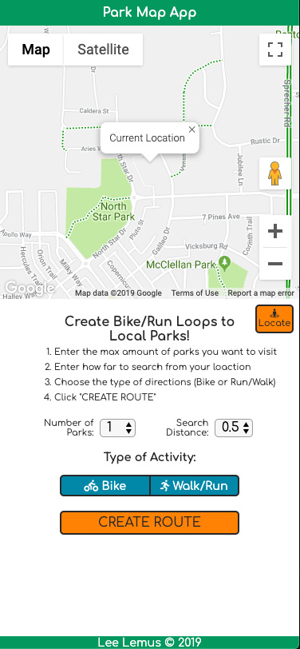
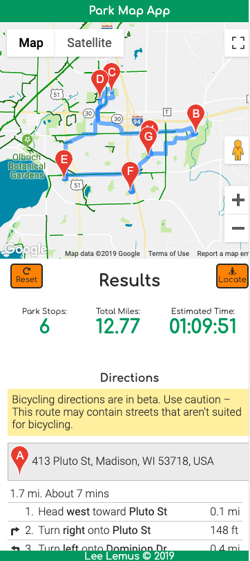
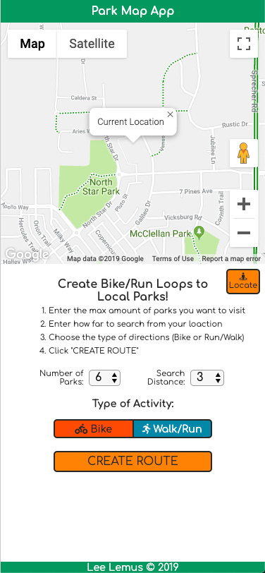
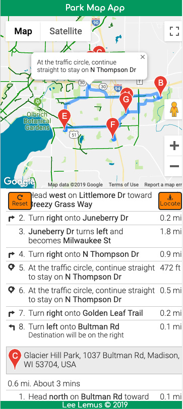

<h1>Park Map App</h1>

Live demo: https://leelemus.github.io/playground-map-app/

<h2>High Level Description</h2>

This app will create a bike or walk/run loop that will take you up to 23 Parks that are up to 30 miles away from your location. Just follow 4 easy steps!

<ol>
    <li>Enter the max amount of parks you want to visit</li>
    <li>Enter how far to search from your loaction</li>
    <li>Choose the type of directions (Bike or Run/Walk)</li>
    <li>Click "CREATE ROUTE"</li>
</ol>

<h2>More Technical Description</h2>

The app requires 4 piece of data to create a loop:

<ol>
    <li>user's device location</li>
    <li>Maximum number of parks to visit</li>
    <li>Radius distance for search</li>
    <li>Type of directions wanted (Bike or Run)</li>
</ol>

The app takes this user input and returns the following:

<ul>
    <li>updated map with a highlighted route around parks that starts and ends at the location that the user initially intiated the search
    <li>Summary of results
        <ul>
            <li>Total Park Stops</li>
            <li>Total Mileage</li>
            <li>Estimated Time to finish loop</li>
        </ul>
    </li>
    <li>Turn by turn directions
        <ul>
            <li>Each individual direction can be clicked on to display it's position on the map</li>
        </ul>
    </li>
</ul>

There are also two buttons, a locate and reset button:

<ul>
    <li>Locate - initiates a geolocation call and displays the device's current location.</li>
    <li>Reset - this button appears after you submit your initial request.  Clicking it restarts the app.</li>
</ul>

<h2>Technologies and Tools Used</h2>
<ul>
    <li>HTML 5</li>
    <li>CSS3</li>
    <li>JavaScript</li>
    <li>JQuery</li>
    <li>Google Maps API</li>
</ul>

